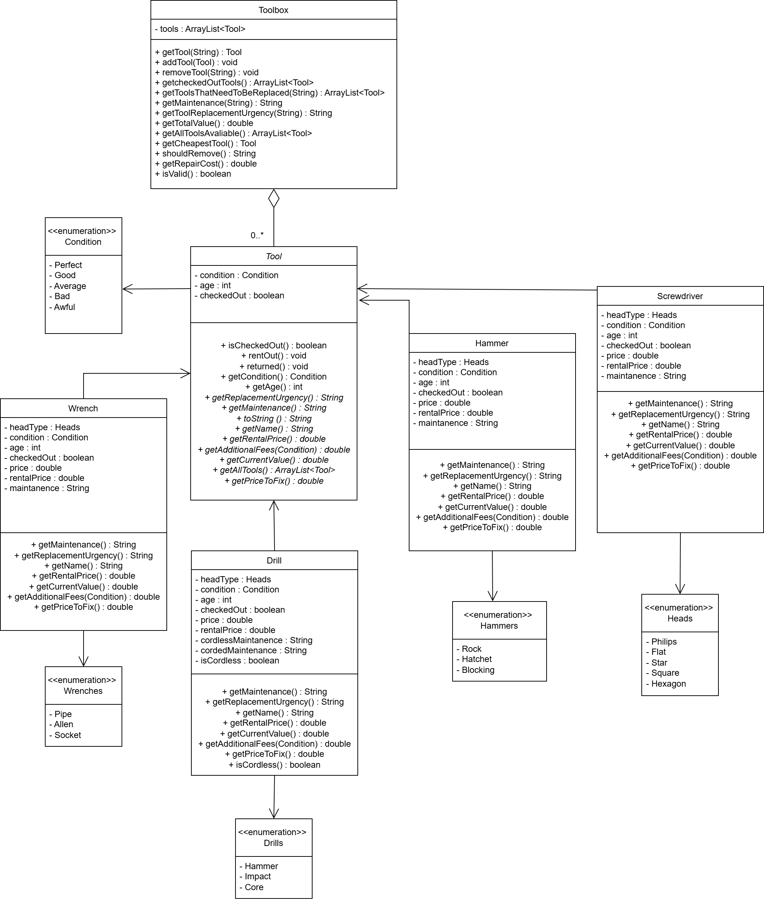

# ICS4U OOP Design Project

See instructions [here](INSTRUCTIONS.md) for details.

 

## Summary
A tool inventory system. It contains a toolbox that has a collection of tools that have a current value, rental value, age, condtion, and specifics about the tool itself (head type or drill type). It allows the user to rent out tools, see rental prices of a tool, and allows them to remove and add tools as needed. It also includes the ability to get the total value of the toolbox, determine if it's better to throw out a tool or reppair it, and get a list of tools that need to be replaced/repaired urgently. It includes an abstarct tool class that has 4 child classes that are used to further specify each tools rental price, current value, age, and specific details. Each child class has an enum for its specific details, like screwdriver heads or drill types, and the parent tool class has an enum class for conditions that the tool can have. 